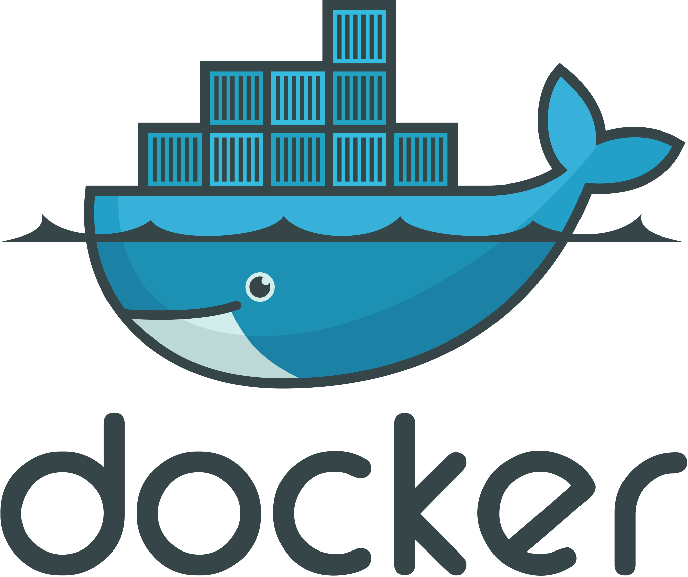

# Docker

<link href="./ASSETS/STYLES.css" rel="stylesheet"></link>
</img>

## What is docker?

[Docker][docker] is an open source platform that enables developers to build, deploy, run, update and manage containers—standardized, executable components that combine application source code with the operating system (OS) libraries and dependencies required to run that code in any environment.

**[⬆ Back to Top](#docker)**

## Why use Docker?

Docker lets developers access these native containerization capabilities using simple commands.

**[⬆ Back to Top](#docker)**

## Why should someone use a container instead of a Virtual Machine?

Container technology offers all the functionality and benefits of VMs—including application isolation, cost-effective scalability, and disposability—plus important additional advantages:

- Lighter weight: Unlike VMs, containers don’t carry the payload of an entire OS instance and hypervisor. They include only the OS processes and dependencies necessary to execute the code. Container sizes are measured in megabytes (vs. gigabytes for some VMs), make better use of hardware capacity, and have faster startup times.

-  Improved developer productivity: Containerized applications can be written once and run anywhere. And compared to VMs, containers are faster and easier to deploy, provision and restart. This makes them ideal for use in continuous integration and continuous delivery (CI/CD) pipelines and a better fit for development teams adopting Agile and DevOps practices

- Greater resource efficiency: With containers, developers can run several times as many copies of an application on the same hardware as they can using VMs. This can reduce cloud spending.

**[⬆ Back to Top](#docker)**

## What is Docker Compose?

[Docker Compose][docker-compose] manages multi-container applications, where all containers run on the same Docker host.

Docker Compose creates a YAML (.YML) file that specifies which services are included in the application and can deploy and run containers with a single command.  

Developers can also use Docker Compose to define persistent volumes for storage, specify base nodes, and document and configure service dependencies.

**[⬆ Back to Top](#docker)**

## What is Kubernetes?

[Kubernetes][kubernetes] is an open-source container orchestration platform descended from a project developed for internal use at Google.

Kubernetes schedules and automates tasks integral to the management of container-based architectures, including container deployment, updates, service discovery, storage provisioning, load balancing, health monitoring, and more.

**[⬆ Back to Top](#docker)**

[docker]: https://www.docker.com/
[docker-compose]: https://docs.docker.com/compose/
[kubernetes]: https://kubernetes.io/
